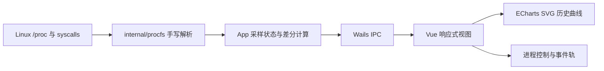

# 系统设计说明

## 架构与数据流



主快照保持 1 Hz 默认采样。累计计数需要保存上次样本和对应墙钟时间；网络或磁盘读取失败时只让该模块降级，CPU、内存和进程等核心数据仍继续工作。前端必须等待一次 IPC 完成后再安排下一次，避免后端变慢时产生请求队列。

## 数据源与公式

| 数据源 | 关键字段 | 计算 |
|---|---|---|
| `/proc/stat` | user/nice/system/idle/iowait/irq/softirq/steal | `(Δtotal-Δidle)/Δtotal×100%` |
| `/proc/meminfo` | MemTotal/MemAvailable/SwapTotal/SwapFree | `used=total-available` |
| `/proc/[pid]/stat` | state/ppid/utime/stime/nice/threads/starttime/vsize/rss | `Δ(utime+stime)/(Δwall×USER_HZ)` |
| `/proc/net/dev` | RX bytes、TX bytes | `Δbytes/Δwall` |
| `/proc/diskstats` | sectors read/written、I/O ms | `Δsectors×512/Δwall` |
| `/proc/[pid]/status` | UID、VmPeak、VmSwap、context switches | 选中进程按需读取 |
| `/proc/[pid]/io` | read_bytes/write_bytes | 显示进程累计实际存储 I/O |

所有累计计数先检查单调性；CPU 热插拔、接口重建或设备重置造成计数回退时，本次速率为 0，防止 `uint64` 下溢。

## 进程控制与身份

Linux 会复用 PID。仅凭界面旧快照中的 PID 操作，可能杀死后来取得同一 PID 的另一个进程。因此接口同时携带 `/proc/[pid]/stat` 字段 22 `starttime`，后端在 `kill(2)` 与 `setpriority(2)` 前重新读取并校验。

额外约束：拒绝 PID≤1、拒绝终止任务管理器自身、只允许 SIGTERM/SIGKILL、nice 范围限制为 [-20, 19]。内核权限规则仍最终生效。

## 真实 fork 演示

Go runtime 使用多线程调度，fork 后直接运行 Go 代码可能继承不一致的锁、GC 和调度器状态。因此 cgo 包装层只做：

```text
parent: fork() → return pid → wait4(pid)
child : fork() → execv("/bin/sleep") → on failure _exit(127)
```

子进程在 `execv` 前不返回 Go runtime，也不执行复杂逻辑。这既提供真实 `fork()` 证据，又遵守多线程程序在 fork 后应立即 exec 的安全原则。

## 技术选型与局限

- Wails 在 Linux 使用 GTK/WebKitGTK 创建原生桌面窗口；界面层使用 Vue，便于实现高密度数据视图。
- WSLg 软件渲染对 canvas 不稳定，因此 ECharts 固定为 SVG renderer。
- WSL2 通常没有标准温度、电池和 GPU sysfs 接口，本项目不伪造这些数据。
- `ClkTck=100` 针对目标 Linux x86_64 环境；移植到特殊架构时应使用 `sysconf(_SC_CLK_TCK)`。
- `/proc/[pid]/io`、exe、cwd、fd 可能因权限不可读；详情接口返回 unavailable 列表而不是让主快照失败。

